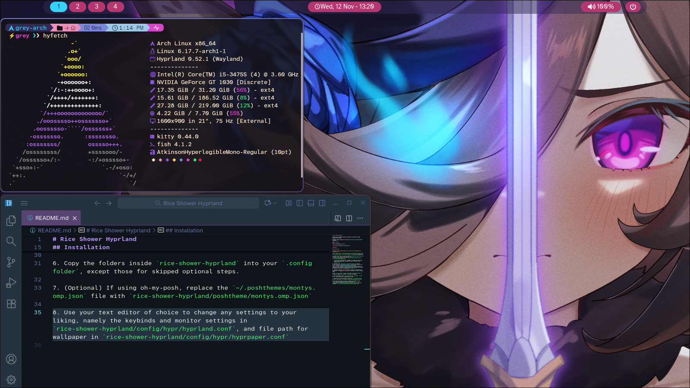
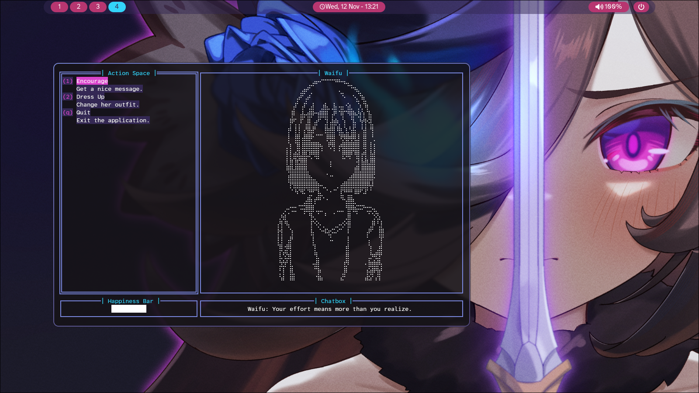

# Rice Shower Hyprland

A Hyprland rice themed around the character Rice Shower from Uma Musume: Pretty Derby.

Wallpaper image created by [Chahan](https://www.pixiv.net/en/artworks/134070371).

 

Screenshot 1

 

Screenshot 2

## Installation

**Warning: These steps assumes you use Arch or an Arch-based Linux distribution.**

1. Run `sudo pacman -S hyprland hyprpaper waybar dolphin kitty wofi libnotify` and `yay -S swaync wlogout` to install the dependencies.

2. Install the [Atkinson Hyperlegible](https://www.brailleinstitute.org/freefont/) font. This can be done with `yay -S ttf-atkinson-hyperlegible-next ttf-atkinson-hyperlegible-next-mono ttf-atkinson-hyperlegible-nerd`

   2.1 If using a different font, remember to change the config files to what you're using and to install a [Nerd Font](https://www.nerdfonts.com/).

3. (Optional) Run `sudo pacman -S fastfetch hyfetch` to install [Fastfetch](https://github.com/fastfetch-cli/fastfetch) and [Hyfetch](https://github.com/hykilpikonna/hyfetch), and install [cliwaifutamagotchi](https://github.com/HenryLoM/CliWaifuTamagotchi). These are mostly aesthetic, but config files are available here (except for Hyfetch, which can be configured with `hyfetch -c`)

4. (Optional) Install [oh-my-posh](https://github.com/JanDeDobbeleer/oh-my-posh). If skipped, don't utilize the configs for Fish or the posh theme.

5. Run `git clone https://github.com/Grey-B/rice-shower-hyprland` to clone this repository or install it through the Releases.

6. Copy the folders inside `rice-shower-hyprland` into your `.config folder`, except those for skipped optional steps.

7. (Optional) If using oh-my-posh, replace the `~/.poshthemes/montys.omp.json` file with `rice-shower-hyprland/poshtheme/montys.omp.json`

8. Use your text editor of choice to change any settings to your liking, namely the keybinds and monitor settings in `rice-shower-hyprland/config/hypr/hyprland.conf`, and file path for wallpaper in `rice-shower-hyprland/config/hypr/hyprpaper.conf`
